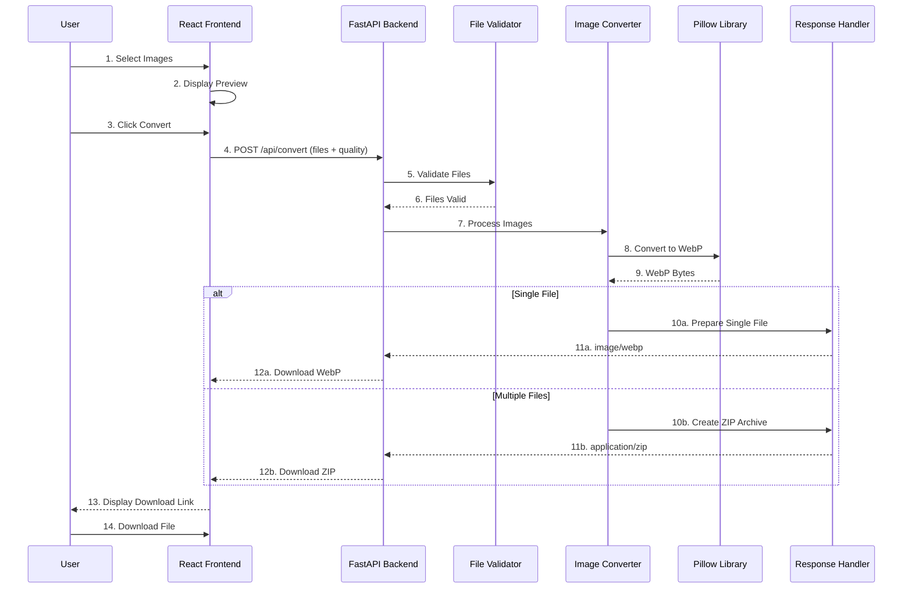

# WebPify 🌐

A modern, full-stack web application for converting images to WebP format with efficient compression and batch processing capabilities.

## Table of Contents

- [Overview](#overview)
- [Features](#features)
- [Tech Stack](#tech-stack)
- [Project Structure](#project-structure)
- [Prerequisites](#prerequisites)
- [Installation](#installation)
  - [Server Setup](#server-setup)
  - [Client Setup](#client-setup)
- [Running the Application](#running-the-application)
- [API Endpoints](#api-endpoints)
- [Supported Image Formats](#supported-image-formats)
- [Usage](#usage)
- [Development](#development)
- [Project Architecture](#project-architecture)
  - [System Architecture Overview](#system-architecture-overview)
  - [Data Flow Diagram](#data-flow-diagram)
  - [Backend Flow](#backend-flow)
  - [Frontend Flow](#frontend-flow)
- [Configuration](#configuration)
- [Troubleshooting](#troubleshooting)

## Overview

WebPify is a fast and efficient image conversion tool that transforms various image formats into WebP format. It features a beautiful, modern UI and a robust FastAPI backend that processes images with minimal overhead. Perfect for developers and designers who need to optimize images for web applications.

## Features

- 🚀 **Fast Conversion**: Efficient server-side processing with minimal memory usage
- 📦 **Batch Processing**: Convert multiple images at once with automatic ZIP download
- 🎨 **Quality Control**: Adjustable compression quality (1-100)
- 🖼️ **Multiple Formats**: Support for PNG, JPEG, BMP, TIFF, GIF, and WebP
- 💾 **In-Memory Processing**: No temporary files, everything processed in memory
- 🎯 **Modern UI**: Beautiful, responsive design built with React and Tailwind CSS
- ⚡ **High Performance**: Built with FastAPI for maximum throughput
- 🔒 **Transparency Support**: Preserves alpha channels for PNG images
- 📱 **Responsive Design**: Works seamlessly on desktop and mobile devices

## Tech Stack

### Frontend
- **React 18.2.0** - Modern UI framework
- **Vite 5.4.21** - Fast build tool and development server
- **Tailwind CSS 3.1.6** - Utility-first CSS framework
- **JSZip 3.10.1** - ZIP file creation for batch downloads

### Backend
- **FastAPI 0.109.0** - Modern, fast Python web framework
- **Uvicorn** - ASGI server for FastAPI
- **Pillow 10.2.0** - Image processing library
- **Python-Multipart** - Form data handling

## Project Structure

```
WebPify/
├── client/                      # React frontend application
│   ├── public/                  # Static assets
│   │   ├── fav.png              # Favicon
│   │   └── manifest.json       # Web app manifest
│   ├── src/                     # Source code
│   │   ├── components/          # React components
│   │   │   ├── FileUpload.jsx    # File upload component
│   │   │   ├── ConversionProgress.jsx  # Progress indicator
│   │   │   ├── ConversionResults.jsx   # Results display
│   │   │   ├── Features.jsx      # Features showcase
│   │   │   ├── Header.jsx        # App header
│   │   │   └── Footer.jsx        # App footer
│   │   ├── App.jsx               # Main App component
│   │   ├── index.jsx             # Entry point
│   │   └── index.css            # Global styles
│   ├── index.html               # Vite HTML template
│   ├── vite.config.js           # Vite configuration
│   ├── package.json             # Frontend dependencies
│   ├── tailwind.config.js       # Tailwind configuration
│   └── postcss.config.js        # PostCSS configuration
│
├── server/                      # Python FastAPI backend
│   ├── utils/                   # Utility modules
│   │   ├── __init__.py
│   │   └── image_converter.py   # Image conversion logic
│   ├── main.py                  # FastAPI application
│   ├── start.py                 # Server startup script
│   └── requirements.txt         # Python dependencies
│
└── README.md                    # This file
```

## Prerequisites

Before you begin, ensure you have the following installed:

- **Node.js** (v18 or higher) and npm
- **Python** (3.8 or higher)
- **pip** (Python package manager)

## Installation

### Server Setup

1. Navigate to the server directory:
```bash
cd server
```

2. Create a virtual environment (recommended):
```bash
python -m venv venv
```

3. Activate the virtual environment:
- On Windows:
```bash
venv\Scripts\activate
```
- On macOS/Linux:
```bash
source venv/bin/activate
```

4. Install Python dependencies:
```bash
pip install -r requirements.txt
```

### Client Setup

1. Navigate to the client directory:
```bash
cd client
```

2. Install Node.js dependencies:
```bash
npm install
```

## Running the Application

### Start the Backend Server

From the `server` directory:
```bash
python start.py
```

The server will start on `http://localhost:8000`

### Start the Frontend Client

From the `client` directory:
```bash
npm run dev
# or
npm start
```

The client will start on `http://localhost:3000` (or the next available port)

### Access the Application

Open your browser and navigate to:
```
http://localhost:3000
```

## API Endpoints

### 🔗 Interactive API Documentation

The API includes comprehensive Swagger/OpenAPI documentation that you can access once the server is running:

**Swagger UI (Interactive):**
```
http://localhost:8000/docs
```
This provides an interactive interface where you can test all API endpoints directly from your browser.

**ReDoc (Documentation):**
```
http://localhost:8000/redoc
```
This provides an alternative documentation view with a clean, readable format.

**OpenAPI JSON Schema:**
```
http://localhost:8000/openapi.json
```
This provides the complete OpenAPI specification in JSON format.

### 📍 API Endpoints

#### Root Endpoint
```http
GET /
```

Returns API information and available endpoints.

**Response:**
```json
{
  "service": "WebPify API",
  "version": "1.0.0",
  "description": "Convert images to WebP format",
  "endpoints": {
    "/api/convert": "POST - Convert images to WebP",
    "/api/health": "GET - Health check",
    "/docs": "GET - Interactive API documentation (Swagger UI)",
    "/redoc": "GET - Alternative API documentation"
  }
}
```

#### Health Check
```http
GET /api/health
```

Returns server health status for monitoring purposes.

**Response:**
```json
{
  "status": "healthy",
  "service": "WebPify API",
  "version": "1.0.0"
}
```

#### Convert Images
```http
POST /api/convert
```

Converts one or more images to WebP format.

**Request Parameters:**
- `files` (List[UploadFile], required): Image files to convert
- `quality` (int, optional): WebP quality (1-100, default: 85)

**Request Format:**
- Content-Type: `multipart/form-data`
- Body: Form data with file(s) and optional quality parameter

**Response:**
- **Single file**: Returns `image/webp` with the converted image
- **Multiple files**: Returns `application/zip` with all converted images

**Example using cURL:**

Single file conversion:
```bash
curl -X POST "http://localhost:8000/api/convert?quality=90" \
  -F "files=@image.png" \
  --output converted.webp
```

Multiple files conversion:
```bash
curl -X POST "http://localhost:8000/api/convert?quality=85" \
  -F "files=@image1.png" \
  -F "files=@image2.jpg" \
  --output converted.zip
```

**Example using Python:**
```python
import requests

# Single file
with open('image.png', 'rb') as f:
    response = requests.post(
        'http://localhost:8000/api/convert',
        files={'files': f},
        params={'quality': 85}
    )
    with open('converted.webp', 'wb') as out:
        out.write(response.content)

# Multiple files
with open('image1.png', 'rb') as f1, open('image2.jpg', 'rb') as f2:
    response = requests.post(
        'http://localhost:8000/api/convert',
        files=[('files', f1), ('files', f2)],
        params={'quality': 90}
    )
    with open('converted.zip', 'wb') as out:
        out.write(response.content)
```

**Example using JavaScript/Fetch:**
```javascript
const formData = new FormData();
formData.append('files', fileInput.files[0]);

const response = await fetch('http://localhost:8000/api/convert?quality=85', {
    method: 'POST',
    body: formData
});

const blob = await response.blob();
const url = window.URL.createObjectURL(blob);
const a = document.createElement('a');
a.href = url;
a.download = 'converted.webp';
a.click();
```

**Example using axios:**
```javascript
const formData = new FormData();
formData.append('files', fileInput.files[0]);

const response = await axios.post(
    'http://localhost:8000/api/convert',
    formData,
    {
        params: { quality: 85 },
        responseType: 'blob'
    }
);

const url = window.URL.createObjectURL(response.data);
const a = document.createElement('a');
a.href = url;
a.download = 'converted.webp';
a.click();
```

### 🎯 Quality Settings

The `quality` parameter controls the compression level of the WebP output:

- **1-70**: High compression, smaller file size
  - Best for: Thumbnails, preview images, mobile optimization
  - Typical size reduction: 75-90% compared to original
  
- **71-85**: Balanced quality and size (recommended)
  - Best for: General web usage, blog images, portfolio galleries
  - Typical size reduction: 60-75% compared to original
  
- **86-100**: High quality, larger file size
  - Best for: High-resolution images, professional photography
  - Typical size reduction: 30-50% compared to original

**Note:** For images with transparency (PNG with alpha channel), quality >= 90 will use lossless compression to preserve transparency perfectly.

### 📚 API Documentation Resources

For developers integrating with the WebPify API:

1. **Interactive Swagger UI**: `http://localhost:8000/docs`
   - Test endpoints directly in your browser
   - View request/response schemas
   - Try the API with real files

2. **OpenAPI Specification**: `http://localhost:8000/openapi.json`
   - Download the complete OpenAPI 3.0 specification
   - Import into API clients (Postman, Insomnia, etc.)
   - Generate client libraries

3. **ReDoc Documentation**: `http://localhost:8000/redoc`
   - Readable, single-page documentation
   - Perfect for understanding the API at a glance

## Supported Image Formats

The application supports the following input formats:

- **PNG** (.png)
- **JPEG** (.jpg, .jpeg)
- **BMP** (.bmp)
- **TIFF** (.tiff, .tif)
- **GIF** (.gif)
- **WebP** (.webp)

## Usage

1. **Select Images**: Click "Choose Files" and select one or more images
2. **Review Selection**: View your selected files with their names and sizes
3. **Convert**: Click "Convert to WebP" to start the conversion process
4. **Download**:**:
   - For a single file: Download the WebP file directly
   - For multiple files: Download the ZIP archive containing all converted images

## Development

### Development Mode

The application runs in development mode with fast hot-reload enabled:

- **Backend**: Auto-reloads on code changes with Uvicorn
- **Frontend**: Instant HMR (Hot Module Replacement) with Vite for rapid development

### Code Structure

- **Backend**: Follows FastAPI best practices with separate utility modules
- **Frontend**: Component-based architecture with Tailwind CSS styling

## Project Architecture

### System Architecture Overview

```
┌──────────────────┐    ┌──────────────────┐    ┌──────────────────┐
│    Frontend      │    │     Backend      │    │  Dependencies   │
│   (React 18)     │    │   (FastAPI)      │    │   & Runtime     │
├──────────────────┤    ├──────────────────┤    ├──────────────────┤
│ • File Upload    │◄──►│ • FastAPI        │    │ • Python 3.8+    │
│ • Progress Bar   │    │ • Uvicorn Server │    │ • Pillow         │
│ • Results Display│    │ • Image Converter│    │ • Node.js        │
│ • JSZip          │    │ • File Validation│    │ • NPM            │
│ • Tailwind CSS   │    │ • CORS Middleware│    │ • Tailwind CSS   │
│ • Vite           │    │ • ZIP Generator  │    │ • Vite           │
└──────────────────┘    └──────────────────┘    └──────────────────┘
```

### Data Flow Diagram



### Backend Flow
1. User uploads images via multipart form data
2. FastAPI receives and validates the files
3. Images are converted to WebP using Pillow in memory
4. Results are streamed back to the client
5. ZIP archive created for multiple files

### Frontend Flow
1. User selects files using the file input
2. Files are displayed with preview
3. On conversion, files are sent to the API
4. Progress indicator shows during processing
5. Results are displayed with download options

## Configuration

### Backend Configuration

The server can be configured in `server/start.py`:
- **Host**: Default `0.0.0.0` (all interfaces)
- **Port**: Default `8000`
- **Reload**: Auto-reload enabled in development

### Frontend Configuration

API endpoint is configured in `client/src/App.jsx`:
```javascript
const API_URL = import.meta.env.VITE_API_URL || 'http://localhost:8000/api/convert';
```

You can create a `.env` file in the `client` directory to set custom environment variables:
```bash
VITE_API_URL=http://localhost:8000/api/convert
```

### Quality Settings

Default WebP quality is set to 85 (good balance between quality and size). You can adjust this in the frontend conversion request.

## Troubleshooting

### Server Issues

**Port already in use:**
```bash
# Windows
netstat -ano | findstr :8000
# Kill the process using the PID

# macOS/Linux
lsof -ti:8000 | xargs kill
```

**Python module not found:**
```bash
pip install -r requirements.txt
```

### Client Issues

**Port 3000 already in use:**
```bash
# Vite will automatically try the next available port (3001, 3002, etc.)
# Or modify the port in vite.config.js
```

**Module not found:**
```bash
npm install
```

**Build errors:**

**On Windows (PowerShell):**
```bash
Remove-Item -Recurse -Force node_modules, package-lock.json
npm install
```

**On macOS/Linux:**
```bash
rm -rf node_modules package-lock.json
npm install
```

### CORS Issues

If you encounter CORS errors, ensure the backend allows requests from `http://localhost:3000`. The CORS middleware is configured in `server/main.py`.

### Image Conversion Errors

- Ensure the image file is not corrupted
- Check that the file format is supported
- Verify the image file size is reasonable (large files may cause memory issues)

## License

This project is licensed under the MIT License - see the [LICENSE](LICENSE) file for details.

## Contributors

Thank you to all contributors who help improve WebPify! 🎉

Want to contribute? Please read [CONTRIBUTING.md](CONTRIBUTING.md) for details on our code of conduct and the process for submitting pull requests.

---

Built with ❤️ using FastAPI and React

